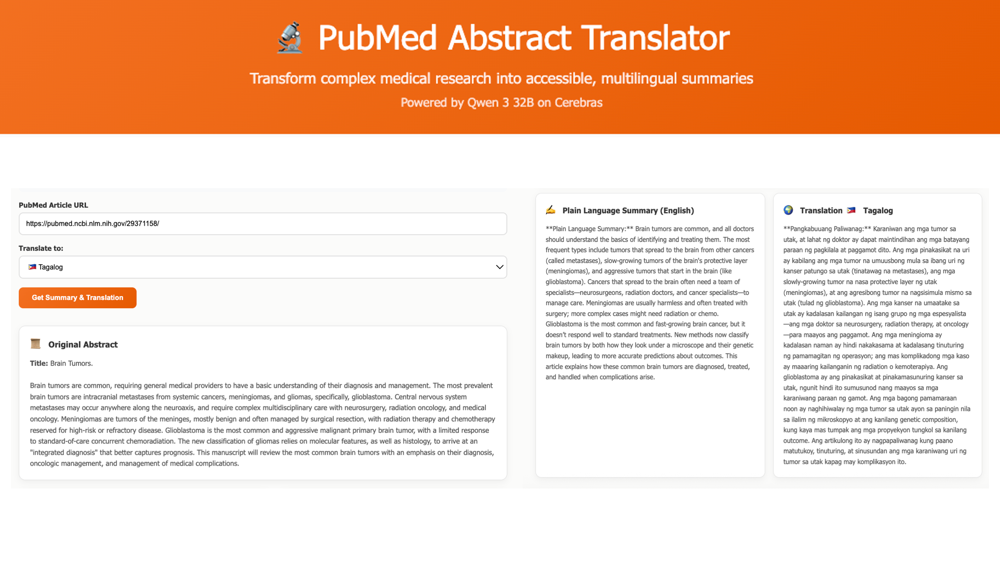

# PubMed Abstract Translator & Multilingual Summarizer

 <!-- Make sure PMAT.png is in an 'assets' folder -->

## 📖 Description

This project is a web-based tool designed to make complex medical research from PubMed more accessible. It fetches a PubMed article abstract, generates a plain language summary in English, and then translates that summary into various languages. The core AI functionalities are powered by the Qwen 3 32B model, accessed via Cerebras on the OpenRouter API.

This tool was developed to help bridge the gap between dense medical jargon and the general public, as well as to provide multilingual access to medical information.

## ✨ Features

*   **PubMed Abstract Fetching:** Enter a PubMed article URL or ID to retrieve its title and abstract.
*   **Plain Language Summarization:** Generates a concise, easy-to-understand summary of the abstract in English using Qwen 3 32B.
*   **Multilingual Translation:** Translates the plain language summary into a variety of user-selected languages, also using Qwen 3 32B.
*   **Streaming Output:** Both summaries and translations are streamed word-by-word for an improved user experience.
*   **Responsive UI:** Designed to be usable on different screen sizes.
*   **Cerebras-Themed UI:** Color scheme inspired by Cerebras Systems.
*   **Explicit Provider Routing:** Configured to specifically request Cerebras as the provider via OpenRouter for Qwen 3 32B model.

## 🌍 Supported Languages for Translation

The tool currently supports translation of the plain language summary into the following languages (selectable in the UI):

*   Arabic
*   Cebuano
*   Chinese (Simplified)
*   Dutch
*   Finnish
*   French
*   German
*   Greek
*   Hebrew
*   Hindi
*   Indonesian
*   Italian
*   Japanese
*   Korean
*   Malay
*   Polish
*   Portuguese
*   Russian
*   Spanish
*   Swedish
*   Tagalog
*   Thai
*   Turkish
*   Ukrainian
*   Vietnamese

*Note: The underlying Qwen 3 32B model supports over 100 languages. More can be added to the dropdown if needed.*

## 🛠️ Technologies Used

*   **Frontend:**
    *   HTML5
    *   CSS3 (with Flexbox for layout)
    *   Vanilla JavaScript (for DOM manipulation, API calls, and dynamic content)
*   **Backend:**
    *   Python 3
    *   Flask (for the local web server and API endpoint)
    *   `requests` library (for fetching data from NCBI)
    *   `xml.etree.ElementTree` (for parsing PubMed XML data)
    *   Flask-CORS (for Cross-Origin Resource Sharing)
*   **APIs & Services:**
    *   **NCBI E-utilities:** To fetch PubMed article abstracts.
    *   **OpenRouter API:** As a gateway to access large language models.
    *   **Qwen 3 32B (via Cerebras on OpenRouter):** For summarization and translation.

## 📂 Project Structure

```
pubmed-translator/
├── .venv/                  # Python virtual environment (if created with this name)
├── app.py                  # Backend Flask application
├── prototype.html          # Frontend HTML, CSS, and JavaScript
└── README.md               # This file
```

## ⚙️ Setup and Installation

### Backend (Python Flask Server)

1.  **Clone the Repository (if applicable) or Download Files:**
    Ensure you have `app.py`.

2.  **Navigate to Project Directory:**
    Open your terminal or command prompt and `cd` into the project's root directory.
    ```bash
    cd path/to/pubmed-translator
    ```

3.  **Create a Python Virtual Environment (Recommended):**
    ```bash
    python3 -m venv .venv
    ```
    (On Windows, you might use `python` instead of `python3`)

4.  **Activate the Virtual Environment:**
    *   On macOS/Linux:
        ```bash
        source .venv/bin/activate
        ```
    *   On Windows (Git Bash or similar):
        ```bash
        source .venv/Scripts/activate
        ```
    *   On Windows (Command Prompt):
        ```bash
        .venv\Scripts\activate.bat
        ```

5.  **Install Dependencies:**
    With the virtual environment active, install the required Python packages:
    ```bash
    pip install Flask requests Flask-CORS
    ```

### Frontend

No special installation is needed for the frontend. The `prototype.html` file can be opened directly in a web browser.

## 🚀 How to Run

1.  **Start the Backend Server:**
    *   Ensure your virtual environment is active.
    *   In your terminal, from the project's root directory, run:
        ```bash
        python app.py
        ```
    *   You should see output indicating the Flask server is running, typically on `http://127.0.0.1:5000/`. Keep this terminal window open.

2.  **Open the Frontend:**
    *   Navigate to the project directory in your file explorer.
    *   Double-click the `prototype.html` file, or right-click and choose "Open with" your preferred web browser (e.g., Chrome, Firefox, Safari, Edge).

## 🔑 API Key Configuration

To use the summarization and translation features, you need an API key from [OpenRouter.ai](https://openrouter.ai/).

1.  Sign up or log in to OpenRouter.
2.  Obtain your API key from your OpenRouter account page.
3.  In the "PubMed Abstract Translator" web interface, paste this key into the "OpenRouter API Key" input field. The key is not stored persistently by default after a page refresh.

## 🙌 Acknowledgements

*   **NCBI E-utilities:** For providing access to PubMed data.
*   **OpenRouter:** For their excellent platform providing access to a variety of LLMs.
*   **Cerebras Systems:** For providing high-performance inference for the Qwen 3 32B model.
*   **Qwen Team (Alibaba Cloud):** For developing the Qwen series of models.

---

Happy Translating! 
